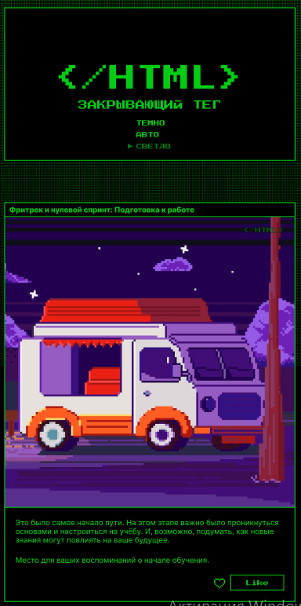
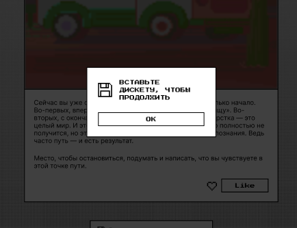

# [Закрывающий тег](https://zakrivayuschiy-teg-f.vercel.app/)

*[Челлендж с сайта Frontend Mentor](https://www.frontendmentor.io/home)

### Обзор

Проект с темизацией, сделанный с целью тренировки трансформаций, анимаций и управления svg

### Скриншоты

### Ссылки

- [Live site URL](https://zakrivayuschiy-teg-f.vercel.app/) - Сайт

### Используемые технологии

- JavaScript
- Адаптивная верстка
- Семантическая верстка HTML5
- Кастомные свойства CSS
- Анимации
- Трансформации
- Flexbox
- CSS Grid